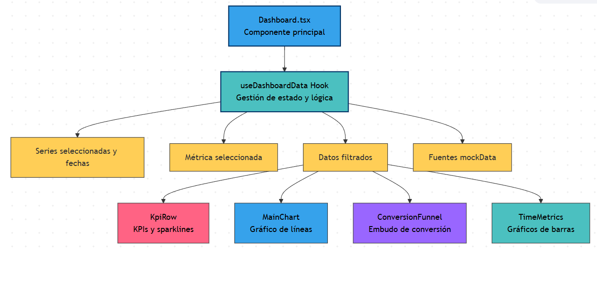
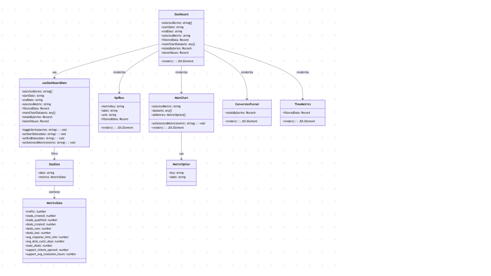
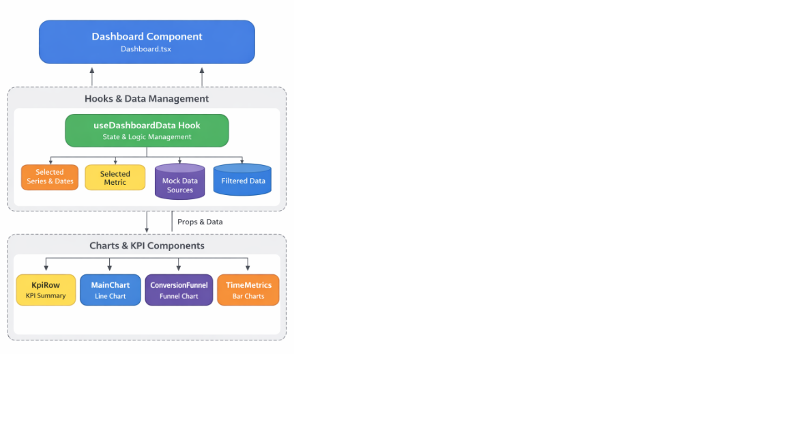

# React + TypeScript + Vite
# Sales Dashboard – Revisión de Gráficos, Funciones y Cálculos

Dashboard de ventas y marketing construido con **React**, **TypeScript** y **Chart.js**.  
Permite visualizar la evolución diaria de métricas clave, comparar series (A, B, C, D) y analizar el funnel de conversión.

---

## **Tecnologías**

- React 18+
- TypeScript
- Vite
- Chart.js v4.5
- react-chartjs-2 v5.3
- date-fns
- chartjs-adapter-date-fns

---

## **Instalación y ejecución**


``` bash
# 1. Clonar el repositorio (si no está ya)
git clone <url-del-repo>
cd fullstack   # o el nombre de la carpeta raíz

# 2. Instalar dependencias
npm install

# 3. Ejecutar en modo desarrollo
npm run dev
```

Estructura 

```
src/
├── main.tsx                  # Punto de entrada, registra adaptadores y Chart.js
├── App.tsx                   # Componente raíz, carga Dashboard
├── chartSetup.ts             # Registro global de elementos de Chart.js
├── types.ts                  # Interfaces de datos (MetricsData, DayData, Series)
├── data/
│   └── mockData.ts           # Generación de datos simulados para las series A, B, C, D
├── hooks/
│   └── useDashboardData.ts   # Hook principal: filtros, métricas, acumulados
├── components/
│   ├── Dashboard.tsx         # Layout principal, filtros y composición
│   ├── KpiRow.tsx            # Tarjetas con último valor y sparkline
│   ├── MainChart.tsx         # Gráfico de líneas diarias con selector de métrica
│   ├── ConversionFunnel.tsx  # Embudo de conversión acumulado (barras horizontales)
│   └── TimeMetrics.tsx       # Gráficos de tiempos de respuesta, ciclo y deals envejecidos
└── index.css                 # Estilos globales básicos
```


Dashboard de evolución de métricas de ventas y marketing para comparar
series temporales (A, B, C, D). Construido con React, TypeScript y Chart.js.

## 🧠 Decisiones técnicas

**Chart.js + react-chartjs-2 en lugar de D3 o Recharts**
Elegí Chart.js porque ofrece gráficos de línea, barra y tiempo con un
registro de elementos explícito, lo que obliga a decidir qué funcionalidad
incluir (tree shaking natural). react-chartjs-2 provee bindings oficiales
que respetan el ciclo de vida de React 18.

**Eje temporal con `chartjs-adapter-date-fns`**
El requisito pide evoluciones diarias durante un año; el adaptador oficial
`date-fns` es el más ligero y funciona sin configuración extra con las
fechas ISO que devuelve el hook de datos.

**Hook `useDashboardData` como única fuente de verdad**
Centraliza el filtrado por rango, la selección de series y la métrica
activa. Todos los componentes reciben los datos ya procesados, lo que
facilita probar y cambiar la UI sin tocar la lógica de negocio.

** Finalmente se cambio y llama a metrics.json la muestra esa estructura ** 

**Datos mock generados en cliente**
Genero 365 días por serie con estacionalidad semanal y tendencia mensual
para que la demo se vea realista. En producción, este módulo se
reemplazaría por una llamada a API sin modificar los componentes.

**Registro global de Chart.js en `chartSetup.ts`**
Importado una sola vez en `main.tsx`. Evita registrar elementos en cada
componente y previene errores is not a registered element`.


## Segunda iteración (qué dejaría para después y por qué)

**Tests unitarios sobre `useDashboardData`**
Es la pieza con más lógica (filtros, acumulados, promedios). Sin tests,
cualquier refactor puede romper los cálculos sin ser evidente a simple
vista.

**Persistencia de filtros en la URL (query params)**
Compartir un dashboard filtrado por fecha y serie es una necesidad real
en equipos. Con `react-router` y `useSearchParams` sería inmediato.

**Tipado más estricto para las claves de métrica**
Actualmente uso `keyof MetricsData` y casts. Una segunda versión debería
generar las listas de métricas desde el metadata del JSON para que el
selector sea dinámico y tipado.

**Carga dinámica de series desde API**
Los datos mock están acoplados. Lo ideal es que el dashboard reciba un
array de URLs o endpoints y resuelva las series sin cambiar componentes.

**Internacionalización de etiquetas y unidades**
Las métricas tienen unidades (`visits`, `min`, `days`) que hoy se
muestran en crudo. Con `i18next` se adaptarían al locale del usuario.
 





